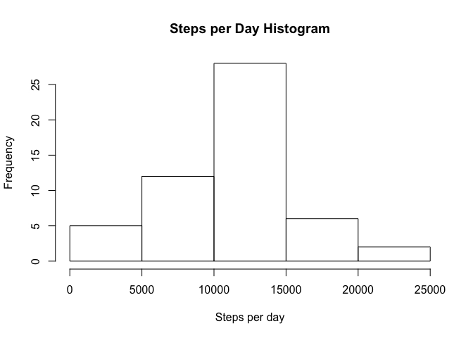
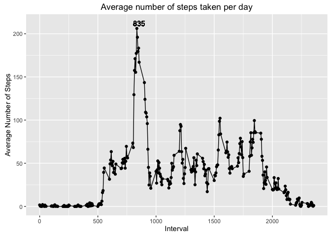
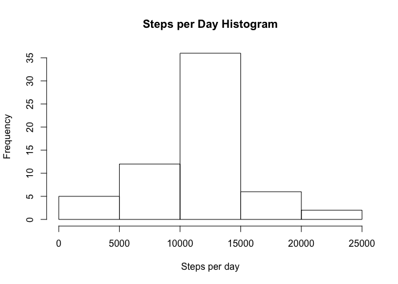
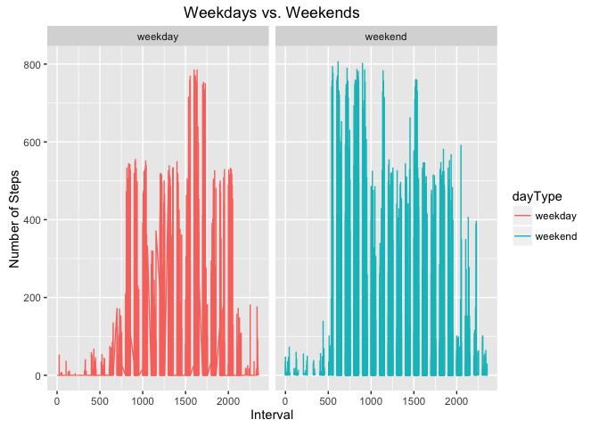

# Activities

### **What is mean total number of steps taken per day?**

**1. Calculate the total number of steps taken per day**


```r
# Read data from file
activity <- read.csv("./activity.csv")
# Group by date and total steps for each date
groupedActivity <- activity %>% na.omit() %>% group_by(date) %>% summarise(steps = sum(steps))
# First rows from grouped data
head(groupedActivity)
```

```
## Source: local data frame [6 x 2]
## 
##         date steps
##       (fctr) (int)
## 1 2012-10-02   126
## 2 2012-10-03 11352
## 3 2012-10-04 12116
## 4 2012-10-05 13294
## 5 2012-10-06 15420
## 6 2012-10-07 11015
```

**2. Generate Steps per Day Histogram**


```r
hist(groupedActivity$steps, xlab = "Steps per day", main = "Steps per Day Histogram")
```



**3. Calculate and report the mean and median of the total number of steps taken per day**

Mean of the total number of steps taken per day


```r
mean(groupedActivity$steps)
```

```
## [1] 10766.19
```

Median of the total number of steps taken per day


```r
median(groupedActivity$steps)
```

```
## [1] 10765
```

### **What is the average daily activity pattern?**

**1. Time series plot of the 5-minute interval and the average number of steps taken, averaged across all days**


```r
# Read data from file
activity <- read.csv("./activity.csv")
# Group data by interval and get the average number of steps per interval along all dates 
dailyActivity <- activity %>% na.omit() %>% group_by(interval) %>% summarise(avg_steps = mean(steps))
# Get the maximum number of steps at all intervals
max_point <- dailyActivity[which(dailyActivity$avg_steps == max(dailyActivity$avg_steps)), ]
# ggplot
ggplot(dailyActivity, aes(interval, avg_steps)) + geom_line() + geom_point() + geom_text(aes(max_point$interval + 20, max_point$avg_steps + 6, label=max_point$interval)) + xlab("Interval") + ylab("Average Number of Steps") + ggtitle("Average number of steps taken per day")
```



**2. Which 5-minute interval, on average across all the days in the dataset, contains the maximum number of steps?**

```
Interval 835
```

### **Inputing missing values**

**1. Calculate and report the total number of missing values in the dataset**


```r
# Read data from file
activity <- read.csv("./activity.csv")
sum(is.na(activity))
```

```
## [1] 2304
```

**2. Devise a strategy for filling in all of the missing values in the dataset.**


```r
# Group data by interval and get the average number of steps per interval along all dates 
dailyActivity <- activity %>% na.omit() %>% group_by(interval) %>% summarise(avg_steps = mean(steps))
# Declare function for substituting NA values with average number of steps for that interval
subs_na <- function(x,avgs){
  for(i in 1:nrow(x))
  {
    if (is.na(x[i,]$steps)) {
      x[i,]$steps <- subset(avgs,avgs$interval == avgs[which(avgs$interval == x[i,]$interval), ]$interval)$avg_steps
    }
  }
  
  return (x)
}
```

**3. Create a new dataset that is equal to the original dataset but with the missing data filled in.**


```r
# Run the function with activities (activity) and grouped activities (dailyActivity) data sets and assing it to a new variable
cleanActivity <- subs_na(activity,dailyActivity)
# First rows from new dataset
head(cleanActivity)
```

```
##       steps       date interval
## 1 1.7169811 2012-10-01        0
## 2 0.3396226 2012-10-01        5
## 3 0.1320755 2012-10-01       10
## 4 0.1509434 2012-10-01       15
## 5 0.0754717 2012-10-01       20
## 6 2.0943396 2012-10-01       25
```

**4. Make a histogram of the total number of steps taken each day and Calculate and report the mean and median total number of steps taken per day. Do these values differ from the estimates from the first part of the assignment? What is the impact of imputing missing data on the estimates of the total daily number of steps?**


```r
# Group the new datase by date and total steps for each date
groupedCleanActivity <- cleanActivity %>% group_by(date) %>% summarise(steps = sum(steps))
# Generate Steps per Day Histogram
hist(groupedCleanActivity$steps, xlab = "Steps per day", main = "Steps per Day Histogram")
```



Mean of the total number of steps taken per day


```r
mean(groupedCleanActivity$steps)
```

```
## [1] 10766.19
```

Median of the total number of steps taken per day


```r
median(groupedCleanActivity$steps)
```

```
## [1] 10766.19
```

```
The mean remains the same at 10766.19, but the median increased and now is equal to the mean, this makes sense since all new values are equal to the mean at that specific interval, so no outliers and the distribution remains basically the same.
```

### **Are there differences in activity patterns between weekdays and weekends?**

**1. Create a new factor variable in the dataset with two levels - weekend and weekday - indicating whether a given date is a weekday or weekend day.**


```r
# Read data from file
activity <- read.csv("./activity.csv")

# Cast date factor to date classs
activity$date <- as.Date(activity$date)

# Create a weekdays vector
wdays <- c('Monday', 'Tuesday', 'Wednesday', 'Thursday', 'Friday')

# Set new variable "dayType" with the corresponding "weekday" or "weekend" variable
activity$dayType <- c('weekday', 'weekend')[(weekdays(activity$date) %in% wdays)+1L]
```

**2. Make a panel plot containing a time series plot (i.e. 𝚝𝚢𝚙𝚎 = "𝚕") of the 5-minute interval (x-axis) and the average number of steps taken, averaged across all weekday days or weekend days (y-axis).**


```r
#qplot
qplot(interval,steps,data=activity, facets=.~dayType, geom = "line", xlab = "Interval", ylab = "Number of Steps", main = "Weekdays vs. Weekends", color=dayType) 
```



*This is an R Markdown document. Markdown is a simple formatting syntax for authoring HTML, PDF, and MS Word documents. For more details on using R Markdown see <http://rmarkdown.rstudio.com>.*
